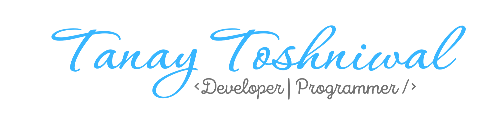

    

# About Me

Hi folks :wave:

I'm Tanay Toshniwal, a Developer by profession and a Musician by passion, with heart of a Biker!

After office hours, you can find me playing my instruments :guitar: :notes:, or cubing . If not, I'm probably out on a bike ride :motorcycle:.

I have a <strong>Youtube Channel</strong> too, do check it out! :wink:

# Frameworks and Libraries:

  
  
  
  
  
  
  
  
  

## Languages:

    
    
    

    

# Contact Me:

  

<!--  -->

<!--  -->

---

 Made with :heart: by Tanay Toshniwal. 

<a href="https://crazykalakaar.com">https://crazykalakaar.com</a>

<a href="https://portfolio.crazykalakaar.com">https://portfolio.crazykalakaar.com</a>

